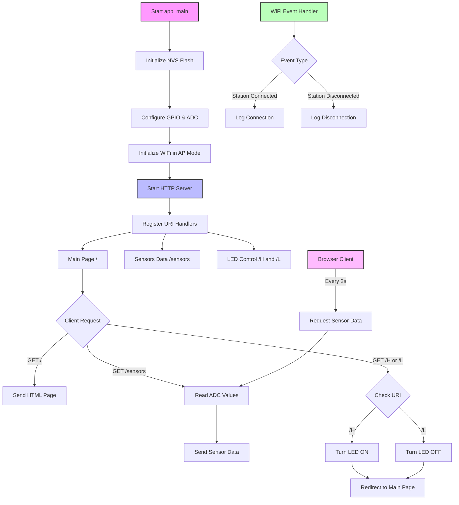

```mermaid
flowchart TD
    A[Start app_main] --> B[Initialize NVS Flash]
    B --> C[Configure GPIO & ADC]
    C --> D[Initialize WiFi in AP Mode]
    
    D --> E[Start HTTP Server]
    E --> F[Register URI Handlers]
    
    %% URI Handlers Registration
    F --> G[Main Page /]
    F --> H[Sensors Data /sensors]
    F --> I[LED Control /H and /L]
    
    %% Main Page Flow
    G --> J{Client Request}
    J -->|GET /| K[Send HTML Page]
    
    %% Sensor Data Flow
    J -->|GET /sensors| L[Read ADC Values]
    L --> M[Send Sensor Data]
    
    %% LED Control Flow
    J -->|GET /H or /L| N{Check URI}
    N -->|/H| O[Turn LED ON]
    N -->|/L| P[Turn LED OFF]
    O & P --> Q[Redirect to Main Page]
    
    %% WiFi Events
    R[WiFi Event Handler] --> S{Event Type}
    S -->|Station Connected| T[Log Connection]
    S -->|Station Disconnected| U[Log Disconnection]
    
    %% Web Client Updates
    V[Browser Client] -->|Every 2s| W[Request Sensor Data]
    W --> L
    
    style A fill:#f9f,stroke:#333,stroke-width:2px
    style E fill:#bbf,stroke:#333,stroke-width:2px
    style R fill:#bfb,stroke:#333,stroke-width:2px
    style V fill:#fbf,stroke:#333,stroke-width:2px
```
