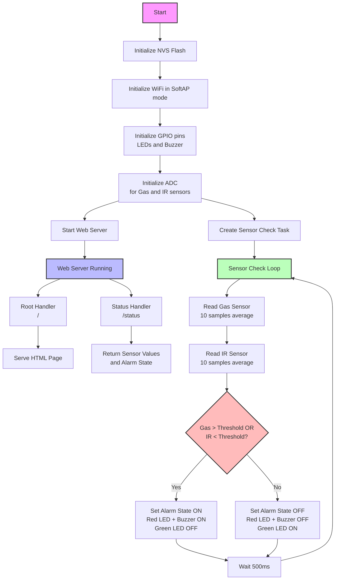

```mermaid
graph TD
    A[Start] --> B[Initialize NVS Flash]
    B --> C[Initialize WiFi in SoftAP mode]
    C --> D[Initialize GPIO pins<br/>LEDs and Buzzer]
    D --> E[Initialize ADC<br/>for Gas and IR sensors]
    
    E --> F[Start Web Server]
    E --> G[Create Sensor Check Task]
    
    G --> H[Sensor Check Loop]
    H --> I[Read Gas Sensor<br/>10 samples average]
    I --> J[Read IR Sensor<br/>10 samples average]
    
    J --> K{Gas > Threshold OR<br/>IR < Threshold?}
    K -->|Yes| L[Set Alarm State ON<br/>Red LED + Buzzer ON<br/>Green LED OFF]
    K -->|No| M[Set Alarm State OFF<br/>Red LED + Buzzer OFF<br/>Green LED ON]
    
    L --> N[Wait 500ms]
    M --> N
    N --> H
    
    F --> O[Web Server Running]
    O --> P[Root Handler</br>/]
    O --> Q[Status Handler</br>/status]
    
    P --> R[Serve HTML Page]
    Q --> S[Return Sensor Values<br/>and Alarm State]
    
    style A fill:#f9f,stroke:#333,stroke-width:2px
    style O fill:#bbf,stroke:#333,stroke-width:2px
    style H fill:#bfb,stroke:#333,stroke-width:2px
    style K fill:#fbb,stroke:#333,stroke-width:2px
```
