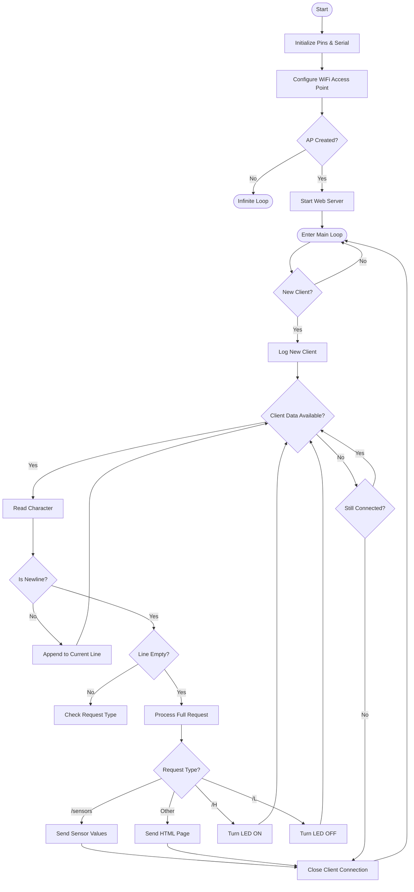

```mermaid
flowchart TD
    Start([Start]) --> Setup[Initialize Pins & Serial]
    Setup --> ConfigAP[Configure WiFi Access Point]
    ConfigAP --> APSuccess{AP Created?}
    APSuccess -->|No| Halt([Infinite Loop])
    APSuccess -->|Yes| StartServer[Start Web Server]
    StartServer --> MainLoop([Enter Main Loop])
    
    MainLoop --> CheckClient{New Client?}
    CheckClient -->|No| MainLoop
    CheckClient -->|Yes| ClientConnected[Log New Client]
    
    ClientConnected --> ReadData{Client Data Available?}
    ReadData -->|No| CheckConnection{Still Connected?}
    ReadData -->|Yes| ProcessChar[Read Character]
    
    ProcessChar --> IsNewLine{Is Newline?}
    IsNewLine -->|No| AppendLine[Append to Current Line]
    IsNewLine -->|Yes| LineEmpty{Line Empty?}
    
    LineEmpty -->|No| CheckEndpoints[Check Request Type]
    LineEmpty -->|Yes| ProcessRequest[Process Full Request]
    
    ProcessRequest --> CheckRequestType{Request Type?}
    CheckRequestType -->|/sensors| SendSensorData[Send Sensor Values]
    CheckRequestType -->|Other| SendHTML[Send HTML Page]
    CheckRequestType -->|/H| TurnLEDOn[Turn LED ON]
    CheckRequestType -->|/L| TurnLEDOff[Turn LED OFF]
    
    SendSensorData --> CloseClient[Close Client Connection]
    SendHTML --> CloseClient
    TurnLEDOn --> ReadData
    TurnLEDOff --> ReadData
    
    AppendLine --> ReadData
    CheckConnection -->|Yes| ReadData
    CheckConnection -->|No| CloseClient
    
    CloseClient --> MainLoop
```
